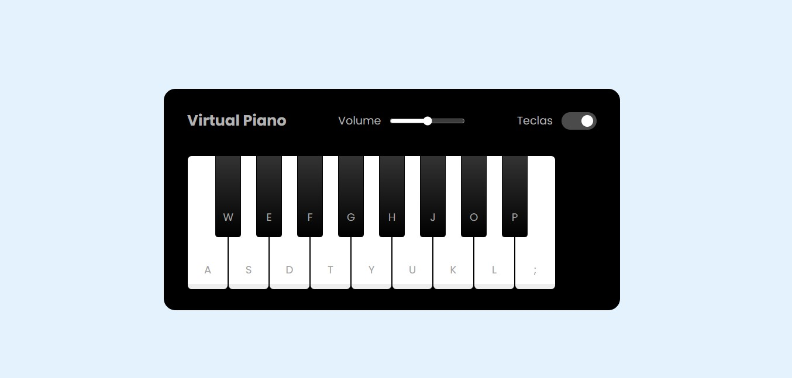

<h1 align="center">Piano Simulator</h1>

Esse é um dos desafios da DIO, conteúdo do Bootcamp da Ri Happy.  

  <a href="#-tecnologias">Tecnologias</a>&nbsp;&nbsp;&nbsp;|&nbsp;&nbsp;&nbsp;
  <a href="#-projeto">Projeto</a>

 

  

## 🚀 Tecnologias

Esse projeto foi desenvolvido com as seguintes tecnologias:

- HTML e CSS
- JavaScript

## 💻 Projeto

Um Simulador de Piano com HTML, CSS e JavaScript.

_Inspirado no projeto original da <a href="https://web.dio.me/track/coding-future-front-end-do-zero">Dio</a>, desenvolvido por <a href="https://www.linkedin.com/in/larissakmnakamura/">Larissa Nakamura</a>._